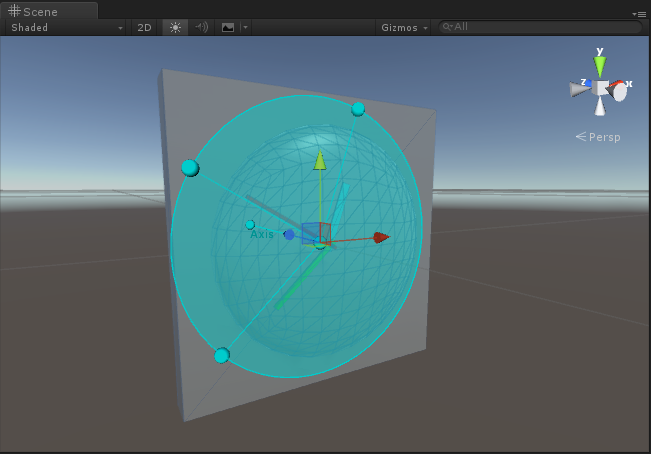
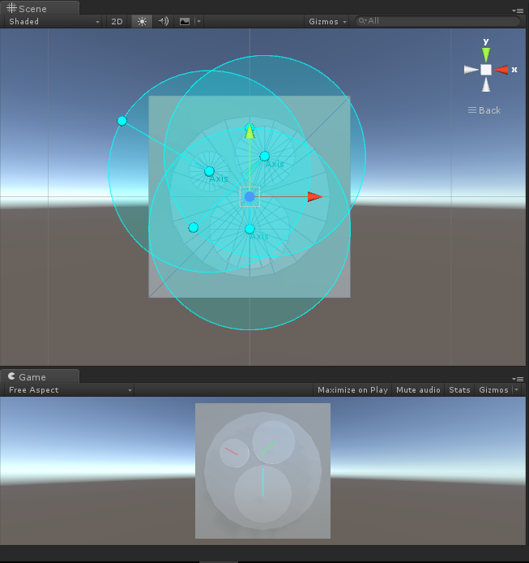

# MGS-Meter
- [中文手册](./README_ZH.md)

## Summary
- Unity plugin for make Clock and Meter in scene.

## Demand
- Standard Clock with Hour, Minute and Second pointers.
- Normal Meter with multi pointers.
- Lerp Meter with multi pointers smooth rotate.

## Environment
- Unity 5.0 or above.
- .Net Framework 3.0 or above.

## Achieve
- Clock : Auto update the angles of Clock pointers base on system time.
- Meter : Update the angles of pointers when the value of Meter changed.
- LerpMeter : Smooth lerp the angles of pointers when the value of Meter changed.

## Demo
- Prefabs in the path "MGS-Meter/Prefabs" provide reference to you.
- Demos in the path "MGS-Meter/Scenes" provide reference to you.

## Preview
- Clock



- Meter



## Contact
- If you have any questions, fell free to contact me at mogoson@qq.com.