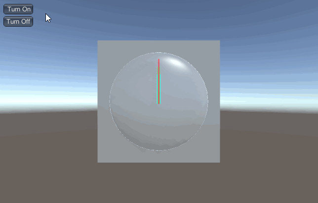
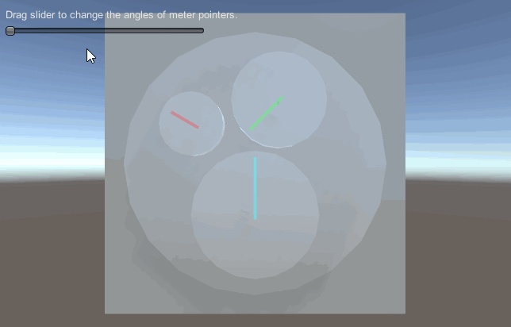

[TOC]

# MGS.Meter

## Summary
- Unity plugin for make Clock and Meter in scene.

## Environment
- .Net Framework 3.5 or above.
- Unity 5.0 or above.

## Platform

- Windows

## Demand

- Standard Clock with Hour, Minute and Second pointers.
- Normal Meter with multi pointers.
- Lerp Meter with multi pointers smooth rotate.

## Usage

1. Add the component to your game object.
2. Set the parameters of the component.

## Demo
- Demos in the path "MGS.Packages/Meter/Demo/" provide reference to you.

## Preview
- Clock



- Lerp Meter



------

Copyright © 2021 Mogoson.	mogoson@outlook.com
