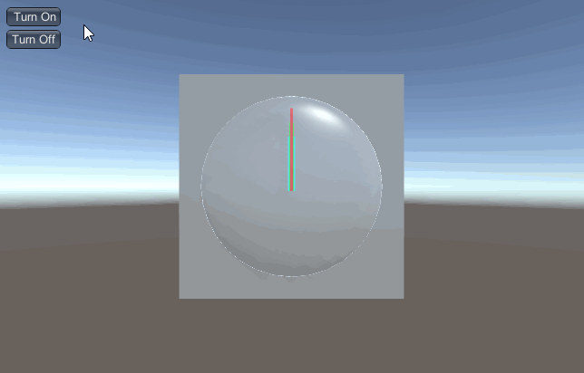
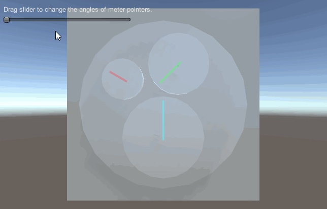

# MGS-Meter
- [English Manual](./README.md)

## 概述
- Unity制作指针类仪表插件包。

## 需求
- 制作标准时钟，即拥有时针，分针和秒针的时钟。
- 制作常规仪表，指针数目不限，数值改变后仪表旋转指针到相应位置。
- 制作插值仪表，指针数目不限，数值改变后仪表指针缓动旋转到相应位置。

## 环境
- Unity 5.0 或更高版本。
- .Net Framework 3.0 或更高版本。

## 方案
- 时钟指针：每秒获取系统当前时间，计算时针，分针和秒针对应的旋转角度。
- 指针旋转：通过欧拉角转换成四元素旋转控制指针旋转角度。
- 多指针协调：指定主指针，其他指针按照指定比率旋转。
- 缓动旋转：通过插值控制旋转角度平滑渐变。

## 实现
- Clock：绑定时钟指针，自动获取系统当前时间，更新指针旋转角度。
- Meter：绑定仪表指针，仪表数值改变后更新指针旋转角度。
- LerpMeter：绑定插值仪表指针，仪表数值改变后插值渐变指针旋转角度。

## 案例
- “MGS-Meter/Prefabs”目录下存有上述时钟和仪表预制，供读者参考。
- “MGS-Meter/Scenes”目录下存有上述功能的演示案例，供读者参考。

## 预览
- Clock



- Meter



## 联系
- 如果你有任何问题或者建议，欢迎通过mogoson@qq.com联系我。